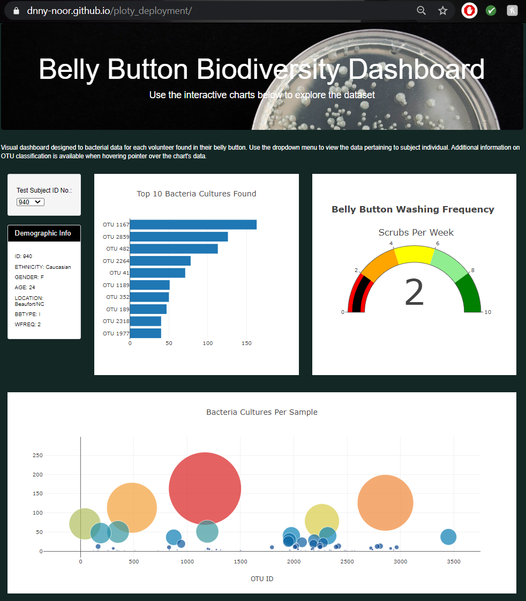

# Belly Button Biodiversity Dashboard

## Project Overview  
Create data visuals with Javascript and Plotly to map out the bacteria found in belly buttons of volunteers. The data would be used to help researches find bacteria to synthesize beef.

## Tables  
1. Bar chart of top 10 bacteria cultures found within subjects belly button. Listed from most amount of cultures to least.  
2. Bubble chart of visual picture of all bacterias size amount within the subjects belly button.  
2. Gauge chart representing number of washings the individual would perform per week.  
  
## Summary  
Visual dashboard designed to bacterial data for each volunteer found in their belly button. Use the dropdown menu to view the data pertaining to subject individual. Additional information on OTU classification is available when hovering pointer over the chart's data.  
  
